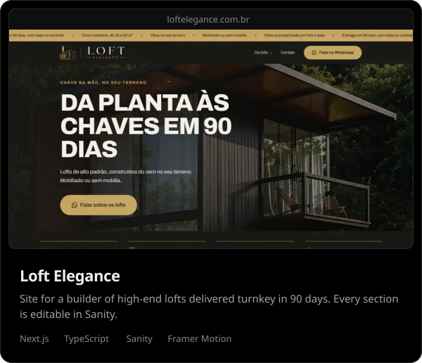
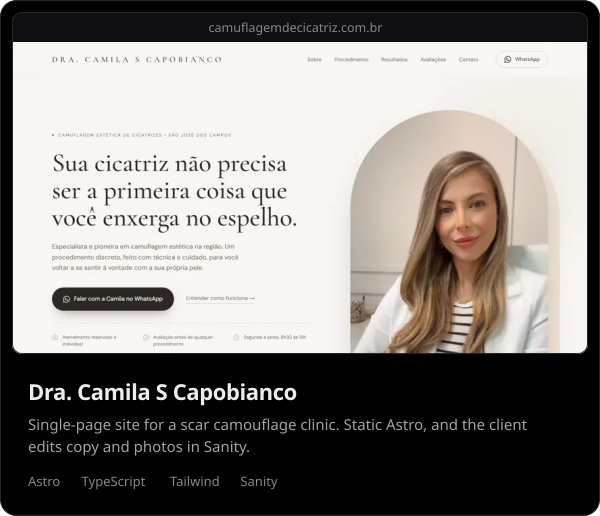
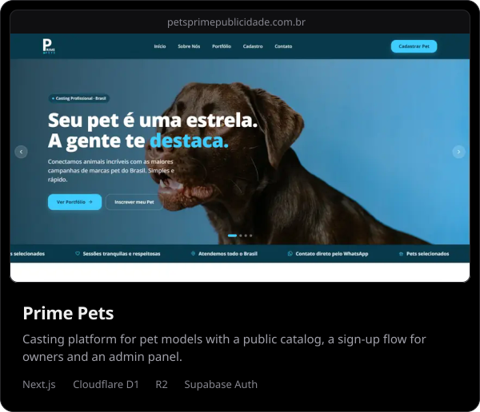
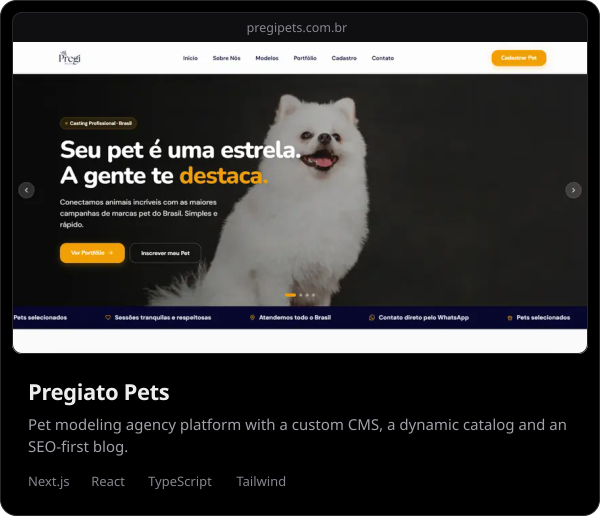
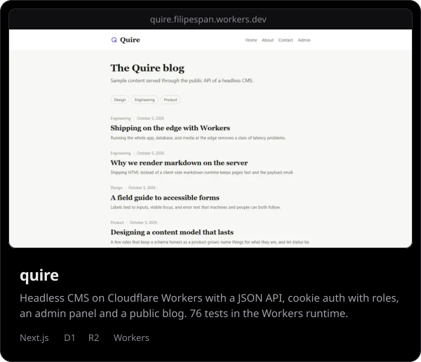
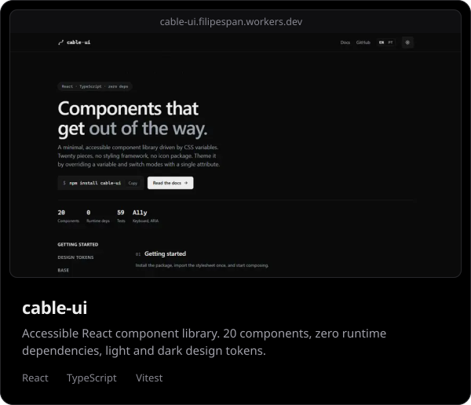
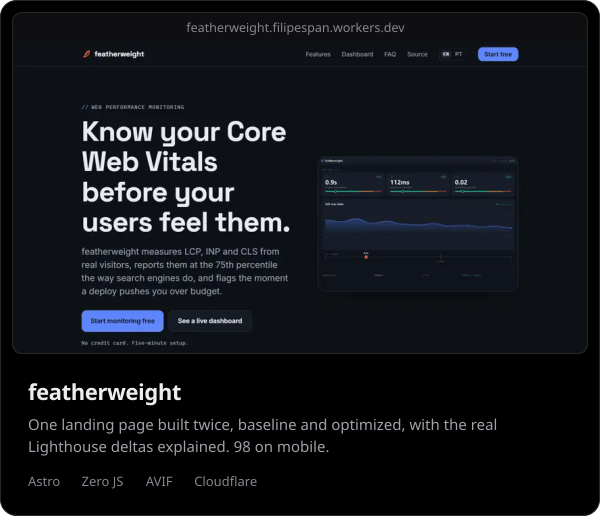
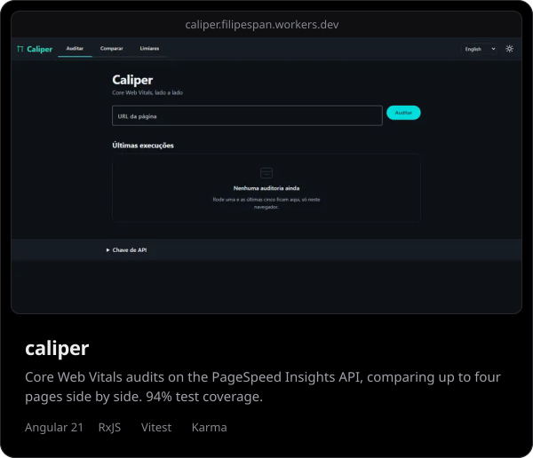

I build sites and web apps with **Next.js, React and TypeScript**, from the first layout to the deploy on Cloudflare. Most of them ship with a CMS the client edits on their own, and every page gets measured before I call it done. Systems Analysis and Development student at FATEC.

Live portfolio at **[filipe.span.dev.br](https://filipe.span.dev.br)**

## Currently

- Building the web platform and a custom CMS for **Pregiato Management**, a modeling agency (freelance)
- Front-end and internal web tools at **Vianelli**

## Client work

<!-- cards:client -->

<!-- /cards:client -->

## Open source

<!-- cards:oss -->

<!-- /cards:oss -->

## Stack

## Contact

[filipe@span.dev.br](mailto:filipe@span.dev.br) &nbsp;&nbsp; [LinkedIn](https://www.linkedin.com/in/filipespan/) &nbsp;&nbsp; [filipe.span.dev.br](https://filipe.span.dev.br)

🇧🇷 Falo português, fique à vontade.
