<picture>
  <source media="(prefers-color-scheme: dark)" srcset="assets/banner-dark.svg">
  
</picture>

Front-end developer building scalable, high-performance interfaces with **Next.js, React and TypeScript**. Experience creating web applications and custom CMS platforms from scratch, with strong focus on design, performance and SEO. Systems Analysis and Development student at FATEC.

**Live portfolio → [filipe.span.dev.br](https://filipe.span.dev.br)**

## Currently

- Building the web platform and a fully custom CMS for **Pregiato Management**, a modeling agency
- Front-end development and internal web tools at Vianelli

Pregiato Management is an ongoing freelance engagement.

## Skills

## Projects

| Project | About | Live |
| --- | --- | --- |
| **Portfolio** | 100% hand-rolled with vanilla JS: PT/EN i18n, interactive terminal, technical SEO, LGPD compliance. Lighthouse 95+ / 100 / 100 / 100. Deployed on Cloudflare Workers. | [filipe.span.dev.br](https://filipe.span.dev.br) |
| **Pregiato Pets** | Web platform with a fully custom CMS (Next.js, React, TypeScript): dynamic catalog, SEO-first blog, admin panel. Lighthouse 85+ / 100 / 100 / 100. | [pregipets.com.br](https://pregipets.com.br) |
| **cable-ui** | Minimal, accessible React + TypeScript component library. 20 components, zero runtime dependencies, light/dark design tokens, tested with Vitest and a hand-built live showcase. | [demo](https://cable-ui.filipespan.workers.dev) · [code](https://github.com/Filipespan/cable-ui) |
| **quire** | Open-source headless CMS on Cloudflare Workers (Next.js, TypeScript). JSON API, cookie auth with roles, admin panel, and a public blog reading the same content layer. D1 + R2, 76 tests in the Workers runtime. | [demo](https://quire.filipespan.workers.dev) · [code](https://github.com/Filipespan/quire) |

## Contact

[filipe.span.dev.br](https://filipe.span.dev.br) · [filipe@span.dev.br](mailto:filipe@span.dev.br) · [linkedin.com/in/filipespan](https://www.linkedin.com/in/filipespan/)

🇧🇷 Falo português, fique à vontade.
